# South Park Script Generator - LangGraph Workflow Diagram

## Overview
This diagram illustrates the complete 13-step LangGraph workflow for collaborative South Park episode generation. The workflow implements a sophisticated multi-agent system where AI personas collaborate through structured brainstorming, discussion, and refinement phases.

## Workflow Flow Diagram

```mermaid
graph TD
    START([START]) --> CONDITIONAL{Dynamic Prompt?}
    
    %% Conditional Entry Point
    CONDITIONAL -->|Yes| RESEARCH[🔍 Research Current Events<br/>Step 1/13]
    CONDITIONAL -->|No| BRAINSTORM[💡 Brainstorm<br/>Step 3/13]
    
    %% News Research Path
    RESEARCH --> USER_REVIEW[👤 User News Review<br/>Step 2/13]
    USER_REVIEW --> BRAINSTORM
    
    %% Core Collaboration Flow
    BRAINSTORM --> QUESTIONS[❓ Interactive Brainstorm Questions<br/>Step 4/13]
    QUESTIONS --> FEEDBACK[💬 Agent Feedback<br/>Step 5/13]
    FEEDBACK --> MERGE[🔀 Merge Outlines<br/>Step 6/13]
    MERGE --> REFINE[✨ Refine Outline<br/>Step 7/13]
    REFINE --> FINAL_DISCUSSION[🎭 Final Discussion<br/>Step 8/13]
    
    %% Script Writing Phase
    FINAL_DISCUSSION --> ACT1[📝 Write Act One<br/>Step 9/13]
    ACT1 --> ACT2[📝 Write Act Two<br/>Step 10/13]
    ACT2 --> ACT3[📝 Write Act Three<br/>Step 11/13]
    
    %% Assembly Phase
    ACT3 --> STITCH[🧵 Stitch Script<br/>Step 12/13]
    STITCH --> SUMMARIZE[📄 Summarize Script<br/>Step 13/13]
    SUMMARIZE --> END([END])
    
    %% Styling
    classDef startEnd fill:#e1f5fe,stroke:#01579b,stroke-width:3px
    classDef conditional fill:#fff3e0,stroke:#e65100,stroke-width:2px
    classDef research fill:#f3e5f5,stroke:#4a148c,stroke-width:2px
    classDef collaboration fill:#e8f5e8,stroke:#1b5e20,stroke-width:2px
    classDef scriptWriting fill:#fff8e1,stroke:#e65100,stroke-width:2px
    classDef assembly fill:#fce4ec,stroke:#880e4f,stroke-width:2px
    
    class START,END startEnd
    class CONDITIONAL conditional
    class RESEARCH,USER_REVIEW research
    class BRAINSTORM,QUESTIONS,FEEDBACK,MERGE,REFINE,FINAL_DISCUSSION collaboration
    class ACT1,ACT2,ACT3 scriptWriting
    class STITCH,SUMMARIZE assembly
```



## Detailed Workflow Steps

### 🔍 Research Phase (Optional)
- **Step 1**: `research_current_events` - Gather current news and events for topical episodes
- **Step 2**: `user_news_review` - Allow user to review and select relevant news items

### 💡 Collaboration Phase
- **Step 3**: `brainstorm` - Multiple AI personas generate initial episode outlines
- **Step 4**: `interactive_brainstorm_questions` - Agents ask each other targeted questions
- **Step 5**: `agent_feedback` - Collaborative feedback and discussion between personas
- **Step 6**: `merge_outlines` - Combine all ideas into a unified episode outline
- **Step 7**: `refine_outline` - Polish and enhance the merged outline
- **Step 8**: `final_discussion` - Final creative discussion before script writing

### 📝 Script Writing Phase
- **Step 9**: `write_act_one` - Generate the first act of the episode
- **Step 10**: `write_act_two` - Generate the second act of the episode
- **Step 11**: `write_act_three` - Generate the third act of the episode

### 🧵 Assembly Phase
- **Step 12**: `stitch_script` - Combine all acts into a complete episode script
- **Step 13**: `summarize_script` - Generate a summary of the final episode

## Key Architecture Features

### 🎯 Conditional Entry Point
The workflow supports two entry modes:
- **Dynamic Prompt Mode**: Starts with news research for topical episodes
- **Direct Mode**: Skips research and goes straight to brainstorming

### 🔄 State Management
The `EpisodeState` object flows through all nodes, accumulating:
- Agent outputs and discussions
- Merged outlines and refinements
- Complete script acts
- Final assembled script and summary

### 📊 Progress Tracking
Each node is wrapped with comprehensive logging:
- Visual progress bars (█████░░░░░)
- Step-by-step completion tracking
- Timestamped file logging to `process.txt`

### 🎭 Multi-Agent Collaboration
- **Personas**: Trey Parker, Matt Stone, Bill Hader (configurable)
- **Specialized Prompts**: Each persona has unique brainstorming, discussion, and refinement templates
- **Temperature Control**: Different creativity levels for different workflow phases

## Technical Implementation

### LangGraph StateGraph Structure
```python
graph = StateGraph(EpisodeState)

# Add nodes with progress tracking
for step in WorkflowStep:
    graph.add_node(step.value, wrap_node_with_progress(node_func, step))

# Define linear flow with conditional entry
graph.set_conditional_entry_point(should_research_news)
graph.add_edge(step1.value, step2.value)  # Sequential dependencies
```

### Type Safety
- **Enum-based steps**: `WorkflowStep` enum prevents string errors
- **TypedDict state**: `EpisodeState` ensures consistent data flow
- **Full type hints**: Throughout the entire codebase

## Usage Examples

### Standard Episode Generation
```bash
spgen generate "Randy becomes obsessed with cryptocurrency"
```

### News-Based Episode Generation
```bash
spgen generate --dynamic-prompt "Create episode about recent AI developments"
```

### Multi-Part Episode Series
```bash
spgen generate --parts 3 "The boys start a podcast empire"
```

---

*This workflow represents a sophisticated implementation of collaborative AI creativity, combining structured processes with creative freedom to generate authentic South Park episode scripts.*
